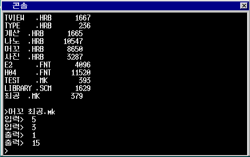

# Mowkow OS

## **머꼬 인터프리터와 GNU Nano가 내장된 32비트 교육용 한글 운영체제**

Mowkow OS는 저서 『OS 구조와 원리』를 기반으로 제작된 교육용 한글 운영체제입니다.<br>
기본적인 커널 구조 위에 독자적인 한글 입력기를 구현하여 자유로운 한글 입출력이 가능합니다. <br>
부산대학교 우균 교수님이 개발한 한글 LIPS 머꼬 인터프리터를 내장하고 있습니다.

### 목차<br>
- [1. 주요 기능](#1-주요-기능)
- [2. 개발 환경](#2-개발-환경)
- [3. 빌드 및 실행 방법](#3-빌드-및-실행-방법)
    - [3-0. ⚠️중요⚠️](#3-0-️중요️)
    - [3-1. 이미지 파일이 있는 경우](#3-1-이미지-파일이-있는-경우)

    - [3-2. 이미지 파일이 없는 경우](#3-2-이미지-파일이-없는-경우)
- [4. 따라 하기](#4-따라-하기)
- [5. 단축키 목록](#5-단축키-목록)
- [6. 명령어 목록](#6-명령어-목록)
- [7. 주의할 점](#7-주의할-점)
- [8. 메모리 레이아웃](#8-메모리-레이아웃)
- [9. 프로젝트 디렉토리](#9-프로젝트-디렉토리)
---

## 1. 주요 기능

- 아키텍처: x86 32-bit 보호 모드
- 멀티태스킹: 라운드 로빈 태스크 스케줄링
- 한글화:
    - 독자적으로 개발한 한글 오토마타 탑재 (두벌식 자판)
    - UTF-8 인코딩 지원
    - 둥근모꼴 비트맵 폰트 적용
- 파일 시스템: FAT12 플로피 디스크 + 파일 기술자를 통한 관리
- 응용 프로그램:

    - GNU Nano(나노)
    - 머꼬
    - 계산기

## 2. 개발 환경

이 프로젝트는 Windows(WSL2) 환경에서 개발되었습니다.

- WSL2: Ubuntu 24.04
- 에뮬레이터: QEMU
- 컴파일러: `CC1` (`gcc` 개량판)
- 어셈블러: `nask` (`nasm` 개량판)
- 빌드 도구: `make`

## 3. 빌드 및 실행 방법

### 3-0. ⚠️중요⚠️

0. 컴퓨터에 QEMU와 make가 설치되어있는지 확인합니다.

    - QEMU가 설치되어있지 않은 경우 아래 링크에서 설치합니다. <br>
    https://www.qemu.org/download/
    - make가 설치되어있지 않은 경우 아래 링크에서 설치합니다. <br>
    https://gnuwin32.sourceforge.net/packages/make.htm

### 3-1. 이미지 파일이 있는 경우

1. QEMU가 설치되었다면 본인의 경로에 맞게 아래 명령어를 입력합니다.<br>
    `<QEMU 경로> -fda  -no-reboot -d int -m 512M`

### 3-2. 이미지 파일이 없는 경우
1. 리포지토리를 로컬 저장소에 클론합니다. <br>
    `git clone https://github.com/yonghun8343/Mowkow-OS.git`

2. 프로젝트의 최상위 디렉토리에서 터미널에 아래 명령어를 입력합니다. <br>
    `make`

3. 본인의 경로에 맞게 아래 명령어를 입력합니다.<br>
    `<QEMU 경로> -fda  -no-reboot -d int -m 512M`

## 4. 따라 하기

1. 콘솔 창에 `목록` 명령어를 입력하여 현재 저장된 파일들을 확인합니다.

2. `나노` 명령어를 입력하여 빈 파일을 나노로 엽니다.

3. 아래에 있는 머꼬 코드를 따라 칩니다.

```
(정의 (나머지 가 나)
      (- 가 (* (/ 가 나) 나)))

(정의 (최대공약수 가 나)
      (만약 (= 나 0)
            가
            (최대공약수 나 (나머지 가 나))))

(정의 (최소공배수 가 나)
      (/ (* 가 나) (최대공약수 가 나)))

(정의 가 (읽기))
(정의 나 (읽기))
(쓰기 (최대공약수 가 나))
(쓰기 (최소공배수 가 나))
```

4. `Ctrl` + `O` 단축키를 누른 후 저장할 파일 이름에 `최공.mk`라고 입력 후 엔터를 누릅니다.<br>한영 전환 단축키는 `Shift` + `Space`입니다.

5. `Ctrl` + `x` 단축키를 눌러 나노를 종료합니다.

6. 다시 콘솔에 `목록` 명령어를 입력하여 디스크에 저장된 `최공.mk` 파일을 확인합니다. 

7. `머꼬 최공.mk` 명령어를 입력하여 머꼬 인터프리터로 `최공.mk`를 실행시킵니다.

8. 실행 결과를 확인합니다.



9. 마우스로 콘솔 창의 `X` 버튼을 눌러 콘솔을 닫고 QEMU를 종료합니다.

## 5. 단축키 목록
`shift` + `Space` : 한영 전환

`shift` + `F2` : 콘솔 열기

`ctrl` + `c` : 프로세스 강제 종료

## 6. 명령어 목록

### 메모리 공간 조회
```bash
# 한글 명령어
> 메모리

# 영어 명령어
> mem
```

### 콘솔 창 지우기
```bash
# 한글 명령어
> 지우기

# 영어 명령어
> clear
```

### 파일 리스트 조회
```bash
# 한글 명령어
> 목록

# 영어 명령어
> ls
```

### 콘솔 종료
```bash
# 한글 명령어
> 종료

# 영어 명령어
> exit
```

### 애플리케이션 실행
```bash
# 현재 콘솔에서 실행
# 예) 나노
> <이름>

# 새 콘솔에서 실행
# 예) 실행 나노
# 예) start 나노
> 실행 <이름>
> start <이름>

# 새 콘솔에서 실행 후 콘솔 바로 닫기
# 예) 바로실행 나노
# 예) ncst 나노
> 바로실행 <이름>
> ncst <이름>
```

### 언어모드 전환(0: 영어, 1: 한글)
```bash
# 한글 명령어
# 예) 언어 1
> 언어 <모드>

# 영어 명령어
# 예) langmode 1
> langmode <mode>
```

## 7. 주의할 점

- 너무 많은 프로세스가 동시에 실행될 경우 그래픽이 깨질 수 있습니다.
가상환경을 껐다 켜주세요.

- 이 OS는 FAT12 플로피 디스크를 저장소로 사용합니다. 저장된 파일이 많아지면 OS 파일 시스템이 읽지 못할 수 있습니다. <br>
    또한 FAT12 파일 시스템 규격에 따라 파일명을 다음 규칙에 맞게 작성해 주십시오. <br>
    (파일 이름 8바이트 + 확장자 3바이트)

- OS 안에서 나노로 작성한 파일은 실제로 이미지 파일에 저장됩니다. <br>
이미지 빌드를 다시 할 경우 기존에 작성해 둔 파일은 삭제되니 주의 바랍니다.

## 8. 메모리 레이아웃

```
	+-------------------+
    |     VRAM Area     |
    |       (VBE)       |
    +-------------------+
            ...     
    +-------------------+
    |     Available     |
    |     Memory        |
    +-------------------+ <--- 0x00400000
    |      Memory       |
    |      Manager      |
    +-------------------+ <--- 0x003c0000
    |     Stack/Data    |
    +-------------------+
    |        BOOT       |
    |        PACK       |
    |      (kernel)     |
    +-------------------+ <--- 0x00280000
    |        GDT        |
    |        Area       |
    +-------------------+ <--- 0x00270000
    |        IDT        |
    |        Area       |
    +-------------------+ <--- 0x0026f800
    |       Empty       |	
    +-------------------+
    |       Disk        |
    |       Image       |
    +-------------------+ <--- 0x00100000
    |     BIOS ROM      |
    +-------------------+ <--- 0x000c0000
    |     VRAM (VGA)    |
    +-------------------+ <--- 0x000a0000
    |   BIOS/Reserved   |
    +-------------------+ <--- 0x0009f000
    |      Available    |
    |      Memory       |
    +-------------------+ <--- 0x00001000
    |       BOOT        |
    |       INFO        |
    +-------------------+ <--- 0x00000ff0
    | Korean Font Addr  |
    +-------------------+ <--- 0x00000fe8
    |    SHTCTL Addr    |
    +-------------------+ <--- 0x00000fe4
    |       Stack       |
    +-------------------+ <--- 0x00000500
    |	Bios Data Area	|
    |	    (BDA)       |
    +-------------------+ <--- 0x00000400
    |        IVT        |
    +-------------------+ <--- 0x00000000
```

## 9. 프로젝트 디렉토리

```
.
├── 📄Makefile
├── 📄README.md
├── 📂app               # 애플리케이션 소스 코드
│   ├── 📄common.mk         # 애플리케이션 공통 빌드 규칙
│   ├── 📁api               # API(.nas) 소스 코드
│   ├── 📁include           # 애플리케이션 개발에 사용되는 라이브러리 및 api 헤더파일
│   ├── 📁timer             # 타이머
│   ├── 📁계산              # 계산기(CLI)
│   ├── 📁나노              # GNU Nano
│   ├── 📁머꼬              # 머꼬 인터프리터
│   └── 📁사진              # 이미지 뷰어(JPEG)
├── 📂src               # 커널 소스 코드
│   ├── 📂boot              # 부트코드
│   │   ├── 📄asmhead.nas
│   │   └── 📄ipl.nas
│   ├── 📂drivers           # 드라이버 소스 코드
│   │   ├── 📄graphic.c         # 그래픽 드라이버
│   │   ├── 📄int.c             # 인터럽트 관리
│   │   ├── 📄keyboard.c        # 키보드 드라이버
│   │   ├── 📄mouse.c           # 마우스 드라이버
│   │   └── 📄timer.c           # 타이머 드라이버
│   ├── 📂graphics          # 그래픽 관련 파일
│   │   └── 📂font
│   │       ├── 📄E2.FNT        # 둥근모꼴 영어 폰트
│   │       ├── 📄H04.FNT       # 둥근모꼴 한글 폰트
│   │       ├── 📄H04.bin
│   │       ├── 📄hankaku.bin
│   │       ├── 📄hankaku.o
│   │       ├── 📄hankaku.obj
│   │       └── 📄hankaku.txt   # 교재 기본 제공 영어 폰트
│   ├── 📂include           # 헤더 파일
│   │   ├── 📄asmfunc.h         
│   │   ├── 📄bootpack.h        
│   │   ├── 📄dsctbl.h          
│   │   ├── 📄fd.h                         
│   │   ├── 📄graphic.h         
│   │   ├── 📄hangul.h          
│   │   ├── 📄input.h           
│   │   ├── 📄int.h             
│   │   ├── 📄memory.h          
│   │   ├── 📄sheet.h           
│   │   ├── 📄timer.h           
│   │   ├── 📄utf8.h            
│   │   └── 📄window.h          
│   ├── 📂kernel            # 커널 구성 코드
│   │   ├── 📄bootpack.c        # 커널
│   │   ├── 📄console.c         # 콘솔
│   │   ├── 📄dsctbl.c          # GDT/IDT
│   │   ├── 📄fd.c              # 파일 디스크립터
│   │   ├── 📄memory.c          # 메모리 관리자
│   │   ├── 📄mtask.c           # 멀티태스킹
│   │   ├── 📄naskfunc.nas      # 어셈블리 함수
│   │   ├── 📄sheet.c           # 시트
│   │   └── 📄window.c          # 창 관리자
│   └── 📂lib               # 라이브러리
│       ├── 📄fifo.c            # FIFO 버퍼
│       ├── 📄hangul.c          # 한글 입출력
│       ├── 📄tek.c             # tek 압축 해제
│       └── 📄utf8.c            # utf8 인코딩
├── 📁testfiles         # 테스트용 파일
└── 📁tools             # 교재 제공 툴셋
```
