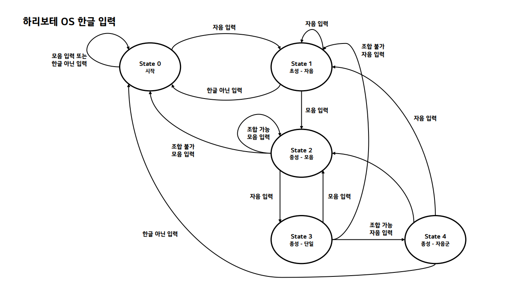

# src/lib

```
│   └── 📂lib               # 라이브러리
│       ├── 📄fifo.c            # FIFO 버퍼
│       ├── 📄hangul.c          # 한글 입출력
│       ├── 📄tek.c             # tek 압축 해제
│       └── 📄utf8.c            # utf8 인코딩
```

커널에서 한글 입출력 및 데이터 송수신에 사용하는 라이브러리 코드입니다.

- `fifo.c` : 타이머/키보드/마우스 데이터 송수신과 태스크 데이터 임시 저장을 위한 FIFO 버퍼
- `hangul.c` : 한글 입출력 처리
- `tek.c` : tek 파일 압축 및 해제
- `utf8.c` : 한글 입출력 처리를 위한 uft-8 인코딩/디코딩

## 한글 입출력에 관하여

### 한글 폰트와 입출력
이 OS는 IT문화원 김중태 원장이 개발하고 퍼블릭 도메인으로 배포한 조합형 글꼴인 "둥근모꼴"을 사용합니다. <br>
조합형 인코딩에서는 한글 여부를 결정하는 최상위비트와, 이후 5비트씩 초성, 중성, 종성을 사용하여 총 16비트(2바이트)로 한글을 표현합니다.

```
    +-------------------------------------+
    | 한/영(1) | 초성(5) | 중성(5) | 종성(5) |
    +-------------------------------------+
```

이 조합형 코드는 VRAM에 글자를 그릴 때, 폰트 데이터 배열에서 해당 자소를 찾기 위한 인덱스로 활용됩니다. <br>자세한 로직은 `hangul.c`의 `put_johab()` 함수를 참고 바랍니다.

단, 시스템 내부의 호환성(GNU Nano, 머꼬 등)과 개발 편의를 위해 커널 내부의 데이터 버퍼링은 utf-8 인코딩을 사용합니다.

- 입력 과정: Key Code -> ASCII -> 한글 오토마타(자소 조합) -> UTF-8 인코딩 -> 입력 버퍼에 저장
- 출력 과정: UTF-8 디코딩 -> UNICODE 변환 -> 조합형 코드 변환 -> VRAM에 폰트 출력

키보드로 입력된 한글은 내부적으로 UTF-8 바이트 스트림으로 변환되어 버퍼에 저장됩니다. 따라서 한글 데이터 처리 시에는 한글이 3바이트임을 고려해야 합니다.

### 입력기

OS에서 구현된 한글 오토마타는 아래 그림처럼 작동합니다.




