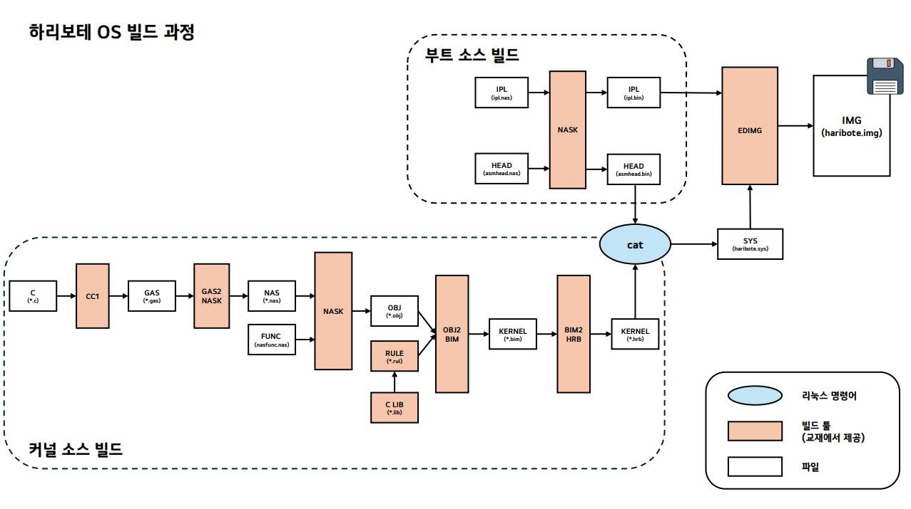

# 빌드 툴셋

`tools/` 디렉토리 하위에 존재하는 프로그램들은 OS 빌드에 사용되는 도구들입니다.

## 주요 도구

| 도구 이름 | 설명 | 사용법 |
|-|-|-|
| `gocc1` | C로 작성된 소스 코드(`.c`)를 `.gas` 파일로 변환하는 데 사용됩니다. | `gocc1 -o a.gas a.c` |
| `gas2nask` | `.gas` 파일을 `.nas` 파일로 변환하는 데 사용됩니다. | `gas2nask [-a] [-e] input-file output-file` |
| `nask` | `.nas` 파일의 어셈블러입니다. | `nask source [object/binary] [list]` |
| `obj2bim` | `.obj` 파일을 `.bim` 파일로 변환하는 데 사용됩니다. | `obj2bim @(rule file) out:(file) [map:(file)] [stack:#] [(.obj/.lib file) ...]` |
| `bim2hrb` | `.bim` 파일을 `.hrb` 파일로 변환하는 데 사용됩니다. | `bim2hrb appname.bim appname.hrb heap-size [mmarea-size]` |
| `edimg` | 디스크 이미지(`.img`) 생성에 사용됩니다. | `edimg imgin:tools/fdimg0at.tek wbinimg src: [IPL] len:512 from:0 to:0 copy from:$(BUILD_DIR)/haribote.sys to:@: ... imgout:[(.img file)]` |
| `makeiso/fdimg2iso` | `.img` 파일로 생성된 디스크 이미지를 `.iso` 파일로 변환하는 데 사용됩니다. | `makeiso/fdimg2iso $tools/makeiso/fdimg2iso.dat source [(.iso file)]` |
| `makefont` | `.txt`로 작성된 비트맵 폰트를 바이너리 파일로 변환하는 데 사용됩니다. | `makefont [binary] [txt]` |
